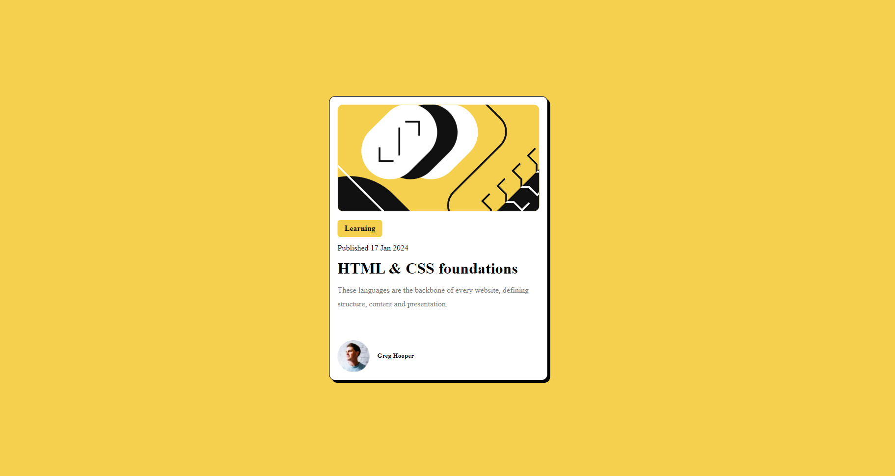

# Frontend Mentor - Blog preview card solution

This is a solution to the [Blog preview card challenge on Frontend Mentor](https://www.frontendmentor.io/challenges/blog-preview-card-ckPaj01IcS). Frontend Mentor challenges help you improve your coding skills by building realistic projects. 

#### Problem credit goes to  Frontend Mentor 

### Screenshot

### Links

- Live Site URL: [Add live site URL here](https://your-live-site-url.com)

### This Project is Built with :

- Semantic HTML5 markup
- CSS3
- Flexbox
- IDE(Vs Code)

## Author

- Website - [Add your name here](https://www.your-site.com)
- Frontend Mentor - [My Frontend Mentor Id](https://www.frontendmentor.io/profile/apex-webdev)

